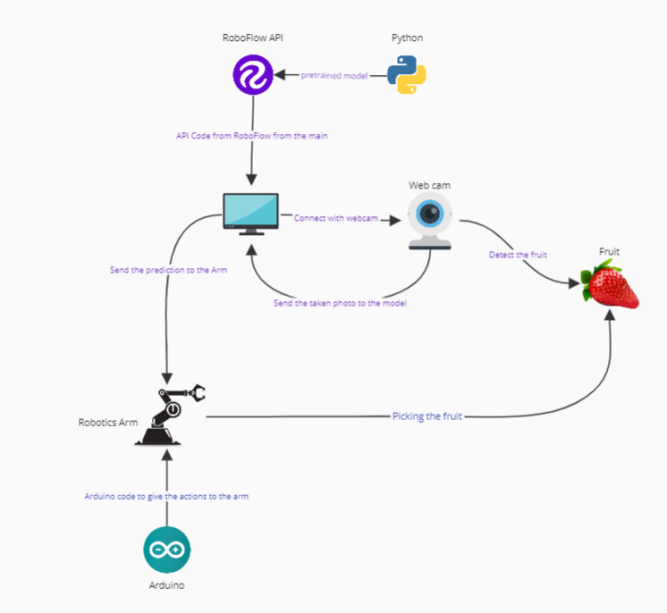

# fruit-classifier-robot-arm
This is a project to classify and sort fruits using Arduino with ComputerVision and a 6DOF arm.

Here is the list of components that we used:
- Arduino
- 6DOF Robot Arm
- Laptop with a USB webcam
- Power Supply

We used an old PCU to supply all motors with power.

If you want more information about the circuit feel free to contact me.

### System Diagram



## How to run
1. Clone the repo or download and extract.
2. Upload the arduino code inside Robotic_arm folder to your arduino.
3. Run ```pip install -r requirements.txt```.
4. Turn on the power for the motors.
5. Run ```main.py```.
6. Connect the arduino to the computer via USB. 
